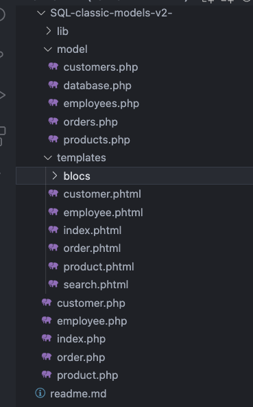
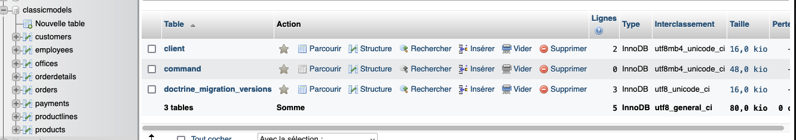
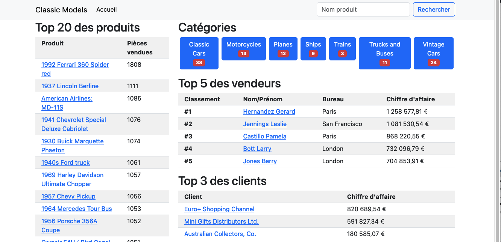
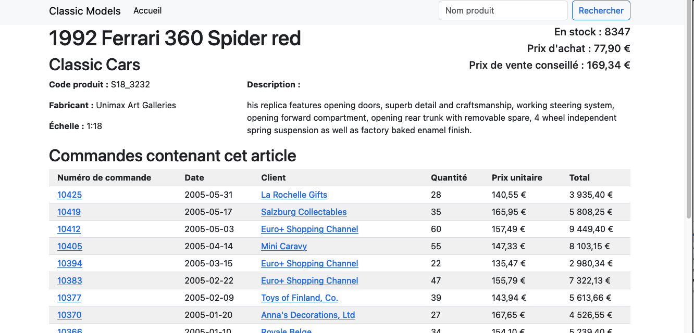

# Classic Models

Utilisation de PHP , PHTML , et d' une BDD

Création d' un site de vente en ligne de model classique en utilisant un  *_model de vue controller_* *_(M-V-C)_* fait  étape par étape 

avec une database classicmodels

voici les images du site de vente en ligne 

